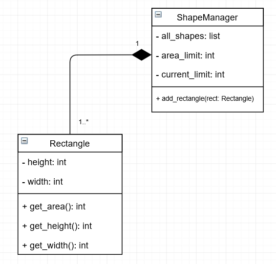
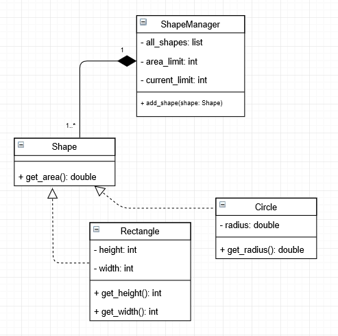

# Classes and Abstract Classes

This tutorial introduces Classes and Abstract classes using a simple application of them

---

### We start by introducing a simple problem to solve:

    The goal is for you to create a simple Shape Manager System with some requirements:
        1. It must be able to manage Rectangle and Circle objects
        2. However it should be written to easily support adding more kinds of 'Shape' classes

        3. The Manager also must have a configurable area limit when starting,
           such that the total area of objects in the manager can be no greater than the limit

Note that it can be done in many ways (the joy of problem solving!) however
the second requirement is quite subjective in what 'easily' could mean.

So have a think of what you would do to solve this.

and now...

## Lets begin!
---

Recall that we can group a bunch of Objects that share common attributes and behavior into a Class.

How you classify objects is entirely dependent on the problem you are trying to solve.

For example, using our problem:

One natural idea to propose here would be to introduce a Rectangle class as we want
to generalise all kinds of rectangles with any length and width.

But in another problem, say a system wants to hold rectangles up to a certain 'weight',
but a tall rectangle has twice as much 'weight' as a long rectangle of the same size.
Here it would make more sense to classify a TallRectangle and LongRectangle separately.

This is the power of what we call Abstraction and seeing these 
different classifications definitely comes from time spent designing.

### Back to the problem,
---

In addition to this Rectangle class, it would
also make sense to have a ShapeManager class to manage a bunch of Rectangle objects.

On a class diagram, this is what I have in mind:

---
Take a look at `classes.py` for how you would define these classes in python as well as
how to Construct some example Objects.
Its important that our code conforms to the class diagram for the benefit of collaborators.
One great thing about class diagrams is that it defines a public interface for all your classes,
so a collaborator could use your class without you having implemented it yet!

---

### Continuing on

This could solve our problem if we also add a Circle class, however one 
immediate issue having said that is that the ShapeManager would require a new method 
for every shape you want it to manage! It would also increase the complexity
of the diagram, as the ShapeManager would have to be associated directly with every shape.

To solve this problem, we first observe that any shape we introduce as a Class (whether it be 
a Circle, Triangle, etc.) will have a way to get its area.
The ShapeManager needs this for every shape it manages. 
This is a common behavior! So lets Abstract!

We can introduce a Shape Class where each 'kind of' Shape would have a way to get its area!

Recall a 'kind of' relationship would suggest an inheritance association, 
however a Shape object can never actually exist (what would be its area!),
only the subclasses can exist (Rectangle, Circle, etc.).

So our Shape class is what we call an Abstract Class.

I've redesigned my solution based on this idea!:

Here the ShapeManager doesnt have to worry about what 'kind of' Shape its given, it could be any 
but it doesnt matter, because the only thing the ShapeManager is interested in is its `get_area()` method
which is why we used this particular abstraction for the problem.

As a consequence, we can simply add new types of Shapes without actually modifying any existing code at all!
I would say this nicely satisfies the second requirement :)

---

So, based on this idea and diagram, you could have a go at creating an implementation
that solves the problem. Use `abc.py` for reference to write up an Abstract Class,
and the solution directory will contain a working implementation to compare yours against.

That concludes this tutorial,

I hope this helps out!

